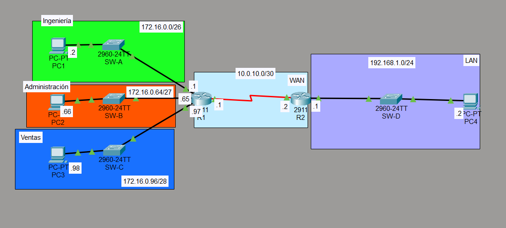
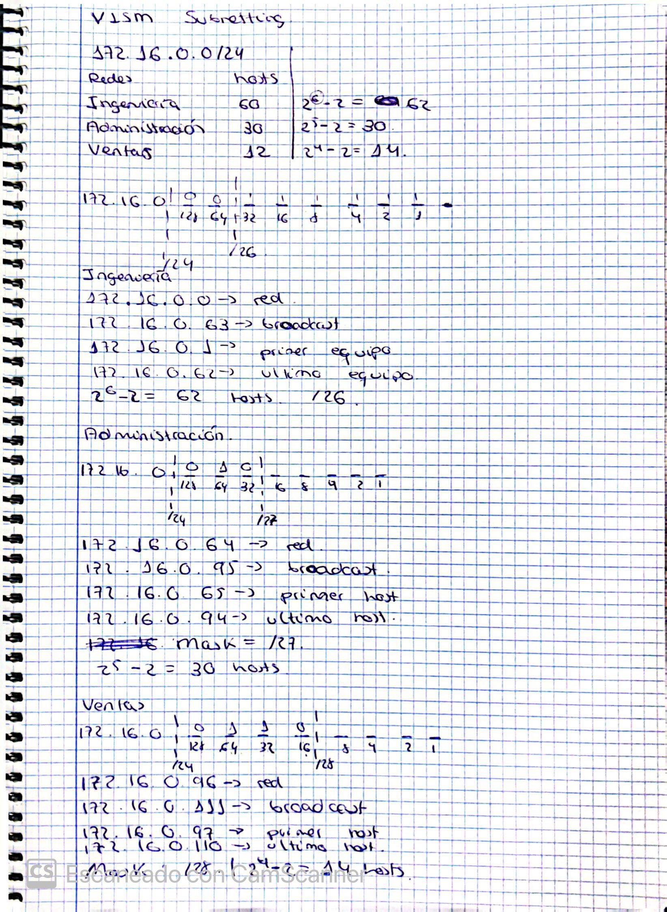
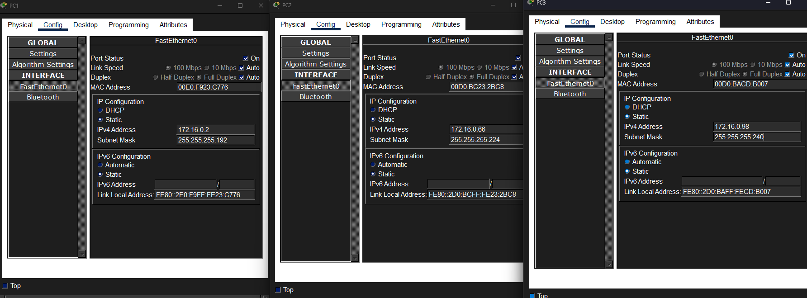
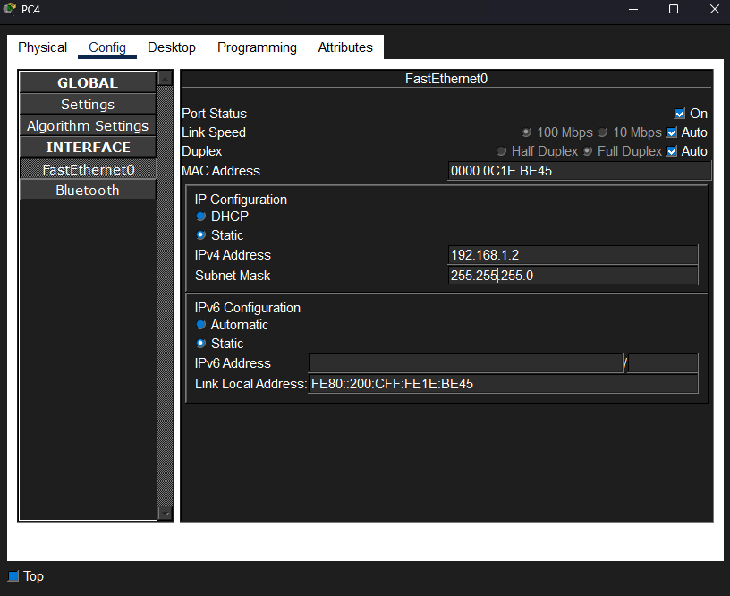

# LAB 2 - VLSM: El arte de no desperdiciar IPs

## Objetivo

Diseñar una red usando **VLSM (Variable Length Subnet Mask)** para no derrochar direcciones IP como si no hubiera un mañana. Básicamente, darle a cada departamento justo lo que necesita, ni más ni menos.

## Topología

Así se ve nuestro monstruo:



Entre **R1** y **R2** hay un enlace serial. Más adelante lo configuramos con OSPF para que se comuniquen.

## Equipos usados

- 2 Routers (R1 y R2, los cerebros de la operación)
- 4 Switches (SW-A, SW-B, SW-C, SW-D — los repartidores de señal)
- PCs al por mayor (una por departamento + la LAN de R2)

## Red base

```
172.16.0.0/24
```

De aquí tenemos que sacar las subredes. A darle al cerebro.

## Requisitos de hosts

| Departamento   | Hosts necesarios |
| -------------- | ---------------- |
| Ingeniería     | 60               |
| Administración | 30               |
| Ventas         | 12               |

## Cálculos



### Resumen rápido (por si no se ve la foto):

**1. Ingeniería — 60 hosts**
- Máscara: /26 → 255.255.255.192
- Hosts útiles: 62 ✅
- Red: `172.16.0.0`
- Rango: `172.16.0.1` - `172.16.0.62`
- Broadcast: `172.16.0.63`

**2. Administración — 30 hosts**
- Máscara: /27 → 255.255.255.224
- Hosts útiles: 30 ✅
- Red: `172.16.0.64`
- Rango: `172.16.0.65` - `172.16.0.94`
- Broadcast: `172.16.0.95`

**3. Ventas — 12 hosts**
- Máscara: /28 → 255.255.255.240
- Hosts útiles: 14 ✅
- Red: `172.16.0.96`
- Rango: `172.16.0.97` - `172.16.0.110`
- Broadcast: `172.16.0.111`

## Configuración de R1

```cisco
Router(config)#hostname R1
R1(config)#int g0/0
R1(config-if)#ip address 172.16.0.1 255.255.255.192
R1(config-if)#desc ## to SW-A ##  (Ingeniería)
R1(config-if)#no shutdown
!
R1(config-if)#int g0/1
R1(config-if)#ip address 172.16.0.65 255.255.255.224
R1(config-if)#desc ## to SW-B ##  (Administración)
R1(config-if)#no shutdown
!
R1(config-if)#int g0/2
R1(config-if)#ip address 172.16.0.97 255.255.255.240
R1(config-if)#desc ## to SW-C ##  (Ventas)
R1(config-if)#no shutdown
```

### Gateways (pa' que las PCs sepan por dónde salir)

| PC  | Gateway        |
| --- | -------------- |
| PC1 | 172.16.0.1     |
| PC2 | 172.16.0.65    |
| PC3 | 172.16.0.97    |



## Red WAN (el enlace entre los routers)

Usamos una /30 porque solo necesitamos 2 hosts y sobra. Clásico.

```cisco
R1(config-if)#int s0/0/0
R1(config-if)#ip add 10.0.10.1 255.255.255.252
R1(config-if)#desc ## to R2 ##
R1(config-if)#no shutdown
!
R2(config)#int s0/0/0
R2(config-if)#ip address 10.0.10.2 255.255.255.252
R2(config-if)#desc ## to R1 ##
R2(config-if)#no shutdown
```

## LAN de R2

Una red /24 para el otro lado.

```cisco
R2(config-if)#int g0/0
R2(config-if)#ip address 192.168.1.1 255.255.255.0
R2(config-if)#desc ## to SW-D ##
R2(config-if)#no shutdown
```

Gateway: `192.168.1.1`



## OSPF (para que se conozcan)

Primero configuramos el clock rate en el serial porque R2 es DCE (el que manda la señal):

```cisco
R2#int s0/0/0
R2(config-if)#clock rate 64000
```

Luego el OSPF:

```cisco
R1(config)#router ospf 1
R1(config-router)#network 10.0.10.0 0.0.0.3 area 1
R1(config-router)#network 172.16.0.0 0.0.0.63 area 1
R1(config-router)#network 172.16.0.64 0.0.0.31 area 1
R1(config-router)#network 172.16.0.96 0.0.0.15 area 1
!
R2(config)#router ospf 2
R2(config-router)#network 10.0.10.0 0.0.0.3 area 1
R2(config-router)#network 192.168.1.0 0.0.0.255 area 1
```

## Ficha del laboratorio

| Campo       | Valor                                          |
| ----------- | ---------------------------------------------- |
| Dificultad  | ★★☆☆☆                                          |
| Tecnologías | Subnetting, Cisco IOS, VLSM                    |
| Software    | Cisco Packet Tracer                             |
| Estado      | ✅ Completado                                   |

---

*Fin del lab. Si ves algún error, probablemente fue el café. ☕*
