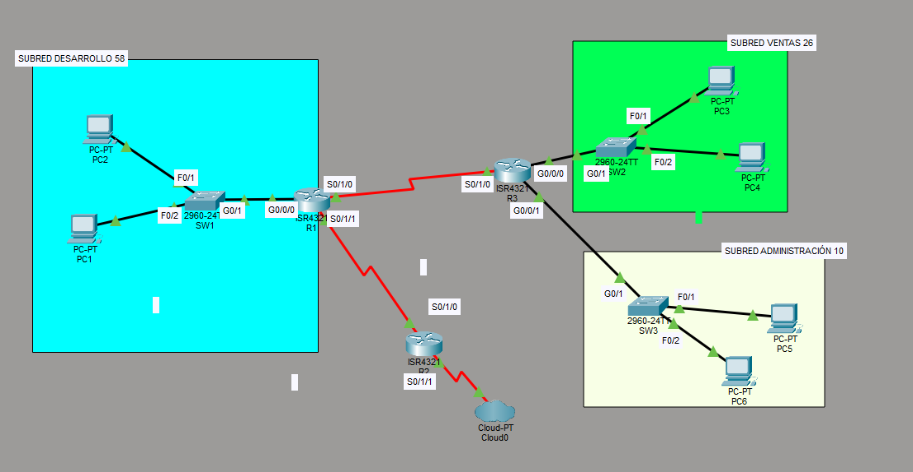
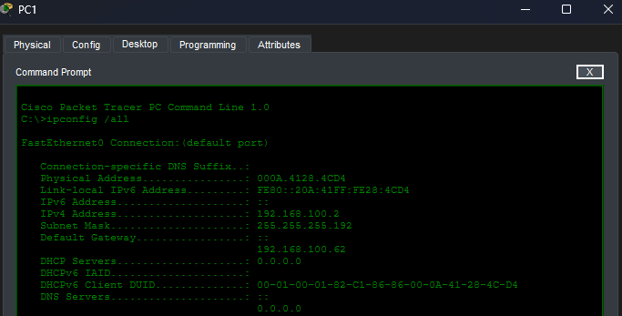
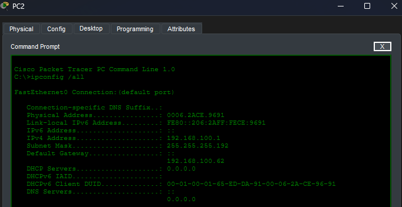
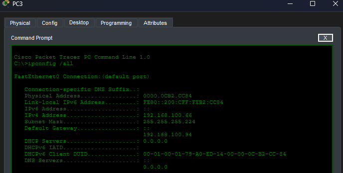
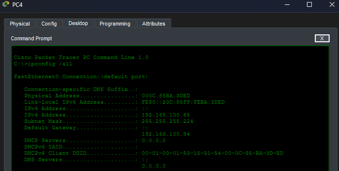
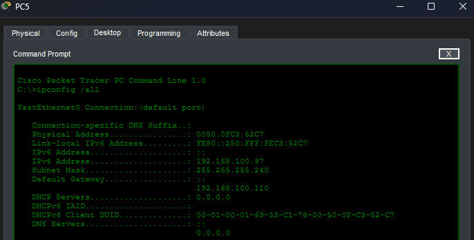
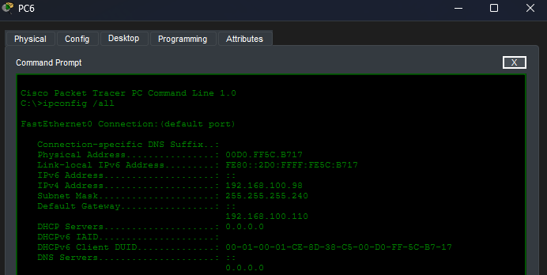
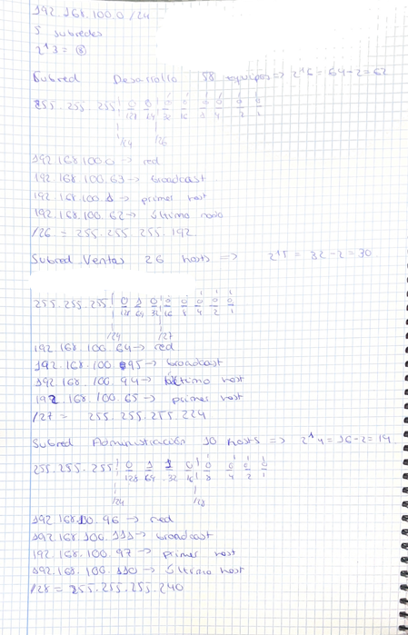
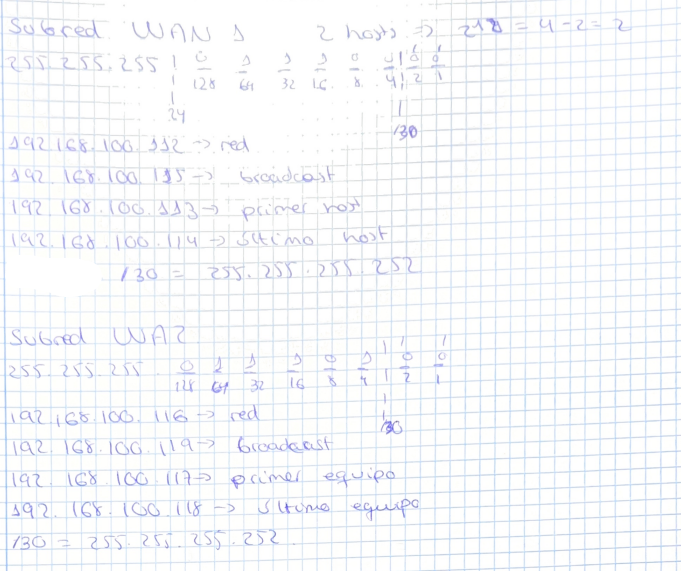

# Subnet Lab 3

## Objetivo

Este laboratorio practica el diseño de un esquema de direccionamiento con VLSM a partir de una red base. El escenario consiste en una sede corporativa con tres departamentos locales y dos enlaces punto a punto entre routers.

## Escenario

Se asigna la red base `192.168.100.0/24` para diseñar el direccionamiento de una sede corporativa que cuenta con 3 departamentos locales y 2 enlaces punto a punto entre routers.

## Topología



## Requerimientos de hosts

| Subred | Departamento / Enlace | Hosts necesarios |
|---|---|---|
| A | Desarrollo | 58 |
| B | Ventas | 26 |
| C | Administración | 10 |
| D | Enlace WAN 1 | 2 |
| E | Enlace WAN 2 | 2 |

## División de la red

Cada subred se dimensiona con la máscara más pequeña que cubre los hosts requeridos:

| Subred | Red | Máscara | Rango utilizables | Broadcast |
|---|---|---|---|---|
| A (Desarrollo) | `192.168.100.0/26` | `255.255.255.192` | `.1` a `.62` | `.63` |
| B (Ventas) | `192.168.100.64/27` | `255.255.255.224` | `.65` a `.94` | `.95` |
| C (Administración) | `192.168.100.96/28` | `255.255.255.240` | `.97` a `.110` | `.111` |
| D (Enlace WAN 1) | `192.168.100.112/30` | `255.255.255.252` | `.113` a `.114` | `.115` |
| E (Enlace WAN 2) | `192.168.100.116/30` | `255.255.255.252` | `.117` a `.118` | `.119` |

## Subred A: Desarrollo (58 hosts)

```text
R1(config)# int g0/0/0
R1(config-if)# ip add 192.168.100.62 255.255.255.192
R1(config-if)# no shut
```

El router utiliza la última dirección utilizable de la subred. PC1 y PC2 se configuran con las primeras direcciones disponibles.





## Subred B: Ventas (26 hosts)

```text
R3(config)# int g0/0/0
R3(config-if)# ip add 192.168.100.94 255.255.255.224
R3(config-if)# no shut
```

El router utiliza la última dirección utilizable de la subred. PC3 y PC4 se configuran con las primeras direcciones disponibles.





## Subred C: Administración (10 hosts)

```text
R3(config)# int g0/0/1
R3(config-if)# ip add 192.168.100.110 255.255.255.240
R3(config-if)# no shut
```

El router utiliza la última dirección utilizable de la subred. PC5 y PC6 se configuran con las primeras direcciones disponibles.





## Subred D: Enlace WAN 1 (2 hosts)

```text
R1(config)# int s0/1/0
R1(config-if)# ip add 192.168.100.113 255.255.255.252
R1(config-if)# no shutdown
!
R3(config)# int s0/1/0
R3(config-if)# ip add 192.168.100.114 255.255.255.252
R3(config-if)# clock rate 64000
R3(config-if)# no shutdown
```

En este enlace serial, R1 utiliza la primera dirección disponible y R3 la segunda.

## Subred E: Enlace WAN 2 (2 hosts)

```text
R1(config)# int s0/1/1
R1(config-if)# ip add 192.168.100.117 255.255.255.252
R1(config-if)# no shutdown
!
R2(config)# int s0/1/0
R2(config-if)# ip add 192.168.100.118 255.255.255.252
R2(config-if)# clock rate 64000
R2(config-if)# no shutdown
```

En este enlace serial, R1 utiliza la primera dirección disponible y R2 la segunda.

> **Nota:** La conexión hacia el Cloud está parcialmente configurada y no realiza ninguna función, por lo que puede generar errores en la simulación.

## Cálculos



