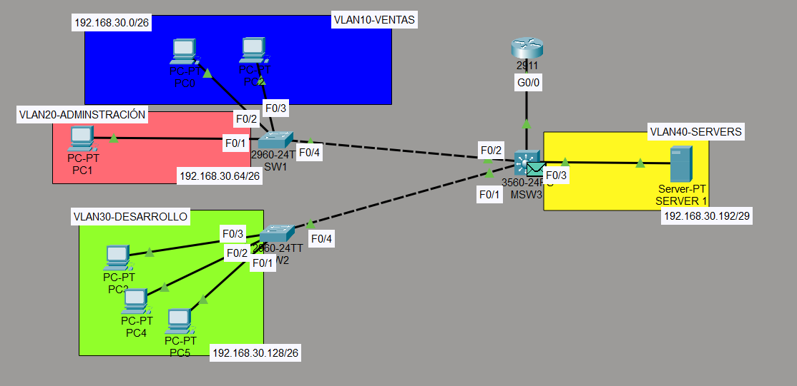
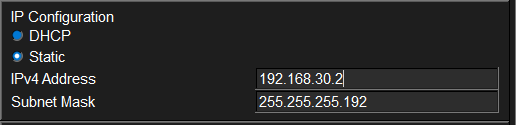
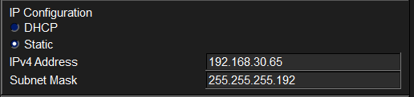
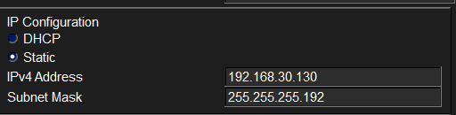
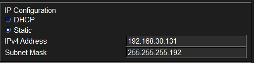
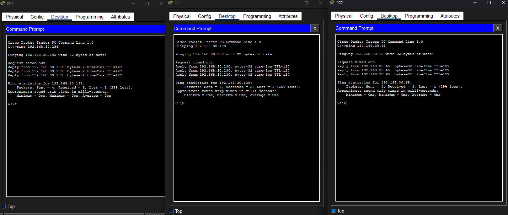
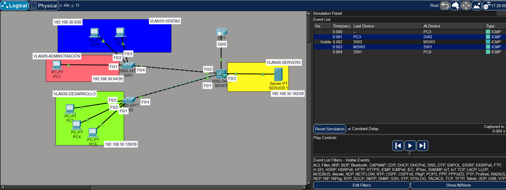

# Ejercicio: VLANs con switch de capa 3

## Escenario

Una empresa tiene dos plantas con los siguientes departamentos:

- **Planta 1:** Ventas y Administración
- **Planta 2:** Desarrollo

El switch multicapa se encuentra en la sala de comunicaciones y se encarga del enrutamiento entre todas las VLANs. Existe un servidor interno al que deben poder acceder todos los departamentos. Los switches se administran mediante una VLAN exclusiva.

## VLANs

| VLAN | Nombre         | Subred              | Gateway          |
| ---- | -------------- | ------------------- | ---------------- |
| 10   | VENTAS         | 192.168.30.0/26     | 192.168.30.62    |
| 20   | ADMINISTRACION | 192.168.30.64/26    | 192.168.30.126   |
| 30   | DESARROLLO     | 192.168.30.128/26   | 192.168.30.190   |
| 40   | SERVERS        | 192.168.30.192/29   | 192.168.30.198   |

## Enlace punto a punto (Router — MSW3)

| Dispositivo | Interfaz | IP             | Máscara          |
| ----------- | -------- | -------------- | ---------------- |
| MSW3        | g0/1     | 192.168.30.201 | 255.255.255.252  |
| Router      | g0/0     | 192.168.30.202 | 255.255.255.252  |

## Topología


## Configuración del router

```cisco
Router(config)#int g0/0
Router(config-if)#ip address 192.168.30.202 255.255.255.252
Router(config-if)#no shutdown
```

## Configuración de switches capa 2

### SW1

```cisco
SW1(config)#int range f0/2-3
SW1(config-if-range)#switchport mode access
SW1(config-if-range)#switchport access vlan 10
!
SW1(config-if-range)#int f0/1
SW1(config-if)#switchport mode access
SW1(config-if)#switchport access vlan 20
!
SW1(config-if)#vlan 10
SW1(config-vlan)#name VENTAS
SW1(config-vlan)#vlan 20
SW1(config-vlan)#name ADMINISTRACION
```

### SW2

```cisco
SW2(config)#int range f0/1-3
SW2(config-if-range)#switchport mode access
SW2(config-if-range)#switchport access vlan 30
!
SW2(config-if-range)#vlan 30
SW2(config-vlan)#name DESARROLLO
```

### MSW3 — Puerto de servidor

```cisco
MSW3(config)#int f0/3
MSW3(config-if)#switchport mode access
MSW3(config-if)#switchport access vlan 40
!
MSW3(config-if)#vlan 40
MSW3(config-vlan)#name SERVERS
```

## Enlaces trunk

### SW1 → MSW3

```cisco
SW1(config)#vlan 40
SW1(config)#vlan 30
SW1(config)#int f0/4
SW1(config-if)#switchport mode trunk
SW1(config-if)#switchport trunk allowed vlan 10,20
SW1(config-if)#switchport trunk native vlan 1001
```

### SW2 → MSW3

```cisco
SW2(config)#vlan 20
SW2(config)#vlan 10
SW2(config)#vlan 40
SW2(config)#int f0/4
SW2(config-if)#switchport mode trunk
SW2(config-if)#switchport trunk allowed vlan 10,30,20,40
SW2(config-if)#switchport trunk native vlan 1001
```

### MSW3

```cisco
MSW3(config)#int f0/2
MSW3(config-if)#switchport trunk native vlan 1001
MSW3(config-if)#switchport trunk allowed vlan 10,20,30,40
!
MSW3(config)#int f0/1
MSW3(config-if)#switchport trunk native vlan 1001
MSW3(config-if)#switchport trunk allowed vlan 10,20,30,40
```

## Configuración del switch multicapa (MSW3)

### Enrutamiento y puerto hacia el router

```cisco
MSW3(config)#ip routing
MSW3(config)#int g0/1
MSW3(config-if)#no switchport
MSW3(config-if)#ip address 192.168.30.201 255.255.255.252
MSW3(config-if)#no shutdown
```

### Ruta por defecto

```cisco
MSW3(config)#ip route 0.0.0.0 0.0.0.0 192.168.30.202
```

### SVIs

```cisco
MSW3(config)#interface vlan10
MSW3(config-if)#ip address 192.168.30.62 255.255.255.192
MSW3(config-if)#no shutdown
!
MSW3(config-if)#interface vlan20
MSW3(config-if)#ip address 192.168.30.126 255.255.255.192
MSW3(config-if)#no shutdown
!
MSW3(config-if)#interface vlan30
MSW3(config-if)#ip address 192.168.30.190 255.255.255.192
MSW3(config-if)#no shutdown
!
MSW3(config-if)#interface vlan40
MSW3(config-if)#ip address 192.168.30.198 255.255.255.248
MSW3(config-if)#no shutdown
```

## Configuración de las PCs

### VLAN 10 — VENTAS

Gateway: `192.168.30.62`




### VLAN 20 — ADMINISTRACION

Gateway: `192.168.30.126`



### VLAN 30 — DESARROLLO

Gateway: `192.168.30.190`





### VLAN 40 — SERVERS


## Pruebas de conectividad

Todos los departamentos deben poder acceder al servidor interno y comunicarse entre sí a través del switch multicapa.



El tráfico entre VLANs pasa primero por el switch multicapa (MSW3), que lo reenvía hacia el destino sin necesidad de pasar por el router.



## Resumen de comandos

| Comando                                      | Descripción                                        |
| -------------------------------------------- | -------------------------------------------------- |
| `ip routing`                                 | Habilita el enrutamiento IP en el switch multicapa |
| `no switchport`                              | Convierte un puerto switch en puerto routado       |
| `interface vlan <id>`                        | Crea o accede a una SVI                            |
| `switchport mode trunk`                      | Configura el puerto como trunk                     |
| `switchport trunk allowed vlan <lista>`       | Permite solo las VLANs indicadas en el trunk       |
| `switchport trunk native vlan <id>`           | Cambia la native VLAN del trunk                    |
