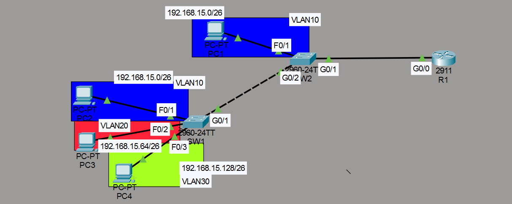
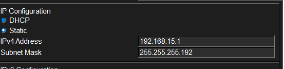
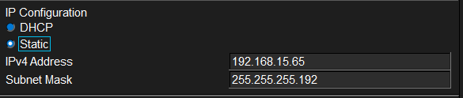
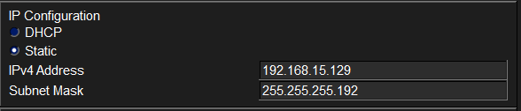
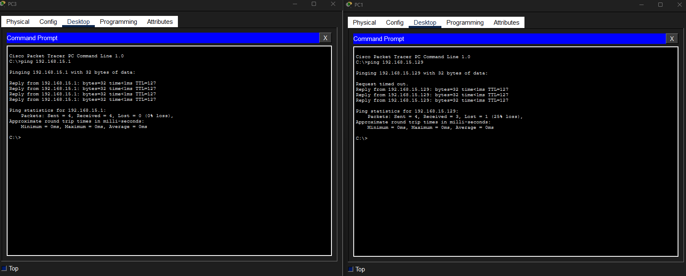

# Ejercicio: VLANs, Trunk y Router-on-a-Stick (ROAS)

## Escenario

Una empresa tiene dos plantas. En cada planta hay equipos de diferentes departamentos. Los equipos de un mismo departamento deben poder comunicarse entre sí aunque estén conectados a switches diferentes. Para lograrlo, se utilizan VLANs, enlaces trunk y Router-on-a-Stick.

### Distribución de las plantas

- **Planta 1:** Ventas, Administración y servidores.
- **Planta 2:** Ventas, Soporte y servidores.

## Equipos necesarios

| Dispositivo             | Cantidad |
| ----------------------- | -------- |
| Router                  | 1        |
| Switch                  | 2        |
| PCs                     | 4        |
| Cables Straight-Through | 6        |

## VLANs

| VLAN | Nombre         | Subred              |
| ---- | -------------- | ------------------- |
| 10   | VENTAS         | 192.168.15.0/26     |
| 20   | SOPORTE        | 192.168.15.64/26    |
| 30   | ADMINISTRACION | 192.168.15.128/26   |

## Topología



La red tiene la siguiente estructura:

- **SW1**: Conecta PC1 (VLAN 10), PC3 (VLAN 20) y PC4 (VLAN 30)
- **SW2**: Conecta PC2 (VLAN 10)
- **Trunk** entre SW1 (g0/1) y SW2 (g0/2)
- **Trunk** entre SW2 (g0/1) y R1 (g0/0)
- **R1**: Router-on-a-Stick con subinterfaces para cada VLAN

## Direccionamiento IP

La **última dirección útil** de cada subred se asigna a la subinterfaz de R1 (gateway).

| VLAN | Subred              | Gateway          | PCs                  |
| ---- | ------------------- | ---------------- | -------------------- |
| 10   | 192.168.15.0/26     | 192.168.15.62    | PC1: .1, PC2: .2     |
| 20   | 192.168.15.64/26    | 192.168.15.126   | PC3: .65             |
| 30   | 192.168.15.128/26   | 192.168.15.190   | PC4: .129            |

## Configuración de los switches

### Puertos access

```cisco
! SW1
SW1(config)#int f0/1
SW1(config-if)#switchport mode access
SW1(config-if)#switchport access vlan 10
!
SW1(config-if)#int f0/2
SW1(config-if)#switchport mode access
SW1(config-if)#switchport access vlan 20
!
SW1(config-if)#int f0/3
SW1(config-if)#switchport mode access
SW1(config-if)#switchport access vlan 30
!
! SW2
SW2(config)#int f0/1
SW2(config-if)#switchport mode access
SW2(config-if)#switchport access vlan 10
```

### Nombres de VLAN

```cisco
SW1(config)#vlan 10
SW1(config-vlan)#name VENTAS
SW1(config-vlan)#vlan 20
SW1(config-vlan)#name SOPORTE
SW1(config-vlan)#vlan 30
SW1(config-vlan)#name ADMINISTRACION
!
SW2(config)#vlan 10
SW2(config-vlan)#name VENTAS
SW2(config-vlan)#vlan 20
SW2(config-vlan)#name SOPORTE
SW2(config-vlan)#vlan 30
SW2(config-vlan)#name ADMINISTRACION
```

### Puertos trunk

Se configuran los trunks permitiendo solo las VLANs necesarias y usando una VLAN no utilizada (VLAN 1002) como native VLAN.

```cisco
! SW1
SW1(config)#int g0/1
SW1(config-if)#switchport mode trunk
SW1(config-if)#switchport trunk allowed vlan 10,30,20
SW1(config-if)#switchport trunk native vlan 1002
!
! SW2
SW2(config)#int g0/2
SW2(config-if)#switchport mode trunk
SW2(config-if)#switchport trunk allowed vlan 10,20,30
SW2(config-if)#switchport trunk native vlan 1002
!
SW2(config-if)#int g0/1
SW2(config-if)#switchport mode trunk
SW2(config-if)#switchport trunk allowed vlan 10,20,30
SW2(config-if)#switchport trunk native vlan 1002
```

## Configuración del router (ROAS)

Se crean subinterfaces en R1 para cada VLAN con encapsulación 802.1Q.

```cisco
R1(config)#int g0/0
R1(config-if)#no shutdown
!
R1(config)#int g0/0.10
R1(config-subif)#encapsulation dot1Q 10
R1(config-subif)#ip address 192.168.15.62 255.255.255.192
!
R1(config-subif)#int g0/0.20
R1(config-subif)#encapsulation dot1Q 20
R1(config-subif)#ip address 192.168.15.126 255.255.255.192
!
R1(config-subif)#int g0/0.30
R1(config-subif)#encapsulation dot1Q 30
R1(config-subif)#ip address 192.168.15.190 255.255.255.192
```

## Configuración de las PCs

### VLAN 10 — VENTAS

Gateway: `192.168.15.62`




### VLAN 20 — SOPORTE

Gateway: `192.168.15.126`



### VLAN 30 — ADMINISTRACION

Gateway: `192.168.15.190`



## Pruebas de conectividad

Se realizaron pruebas de ping para verificar que todas las PCs pueden comunicarse entre sí, incluso si están en diferentes VLANs o conectadas a switches distintos.



## Resumen de comandos

| Comando                                       | Descripción                                    |
| --------------------------------------------- | ---------------------------------------------- |
| `switchport mode access`                      | Configura el puerto como access                |
| `switchport access vlan <id>`                 | Asigna el puerto a una VLAN                    |
| `switchport mode trunk`                       | Configura el puerto como trunk                 |
| `switchport trunk allowed vlan <lista>`       | Permite solo las VLANs indicadas en el trunk   |
| `switchport trunk native vlan <id>`           | Cambia la native VLAN del trunk                |
| `vlan <id>`                                   | Crea o accede a una VLAN                       |
| `name <nombre>`                               | Asigna un nombre a la VLAN                     |
| `interface g0/0.<subinterfaz>`                | Crea una subinterfaz en el router              |
| `encapsulation dot1Q <vlan>`                  | Activa 802.1Q en la subinterfaz para esa VLAN  |
