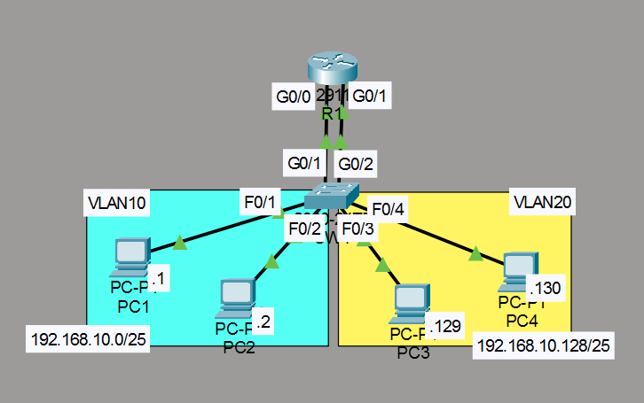
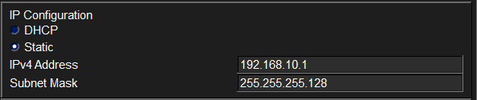
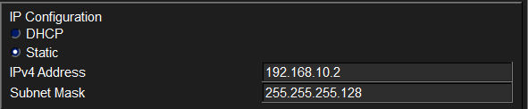
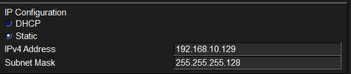
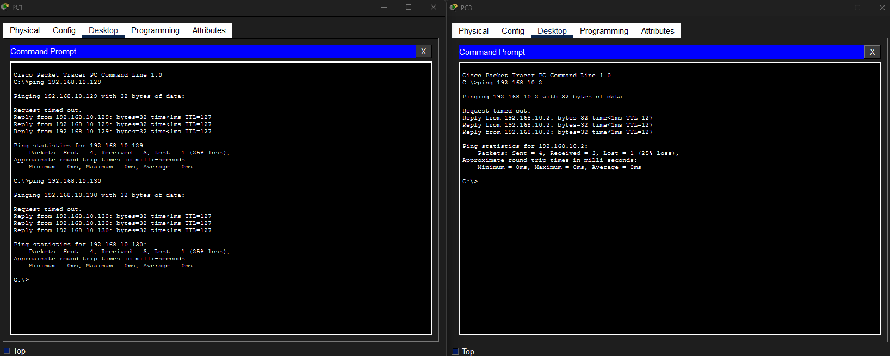
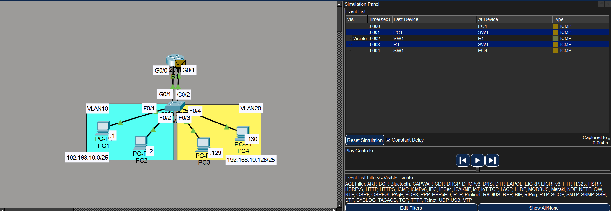

# Ejercicio básico de VLANs

## Objetivo

Configuración VLANS sencillas

## Topología



La red consta de un switch SW1 (Cisco 2960) conectado a cuatro PCs y a un router R1. No se utilizan enlaces trunk; todos los puertos están configurados en modo **access**. El router se encarga de la comunicación entre VLANs (inter-VLAN routing) mediante dos conexiones físicas separadas, una por cada VLAN.

## Equipos necesarios

- 1 switch 
- 1 router
- 4 PCs
- 4 cables Straight-Through

## VLANs creadas

| VLAN | Nombre  | Equipos      |
| ---- | ------- | ------------ |
| 10   | VENTAS  | PC1 y PC2    |
| 20   | SOPORTE | PC3 y PC4    |

## Direccionamiento IP

Se utiliza la red `192.168.10.0/24` dividida en dos subredes /25. La **última dirección útil** de cada subred se asigna a la interfaz del router (gateway).

| Subred              | VLAN | Gateway          | PCs                     |
| ------------------- | ---- | ---------------- | ----------------------- |
| 192.168.10.0/25     | 10   | 192.168.10.126   | PC1: .1, PC2: .2        |
| 192.168.10.128/25   | 20   | 192.168.10.254   | PC3: .129, PC4: .130    |

## Configuración del router (R1)

```cisco
R1(config)#int g0/0
R1(config-if)#ip address 192.168.10.126 255.255.255.128
R1(config-if)#no shutdown
!
R1(config-if)#int g0/1
R1(config-if)#ip address 192.168.10.254 255.255.255.128
R1(config-if)#no shutdown
```

## Configuración del switch (SW1)

Se asignan los puertos a sus respectivas VLANs y se nombran las VLANs.

```cisco
SW1(config)#int range f0/1, f0/2, g0/1
SW1(config-if-range)#switchport mode access
SW1(config-if-range)#switchport access vlan 10
!
SW1(config-if-range)#int range f0/3, f0/4, g0/2
SW1(config-if-range)#switchport mode access
SW1(config-if-range)#switchport access vlan 20
!
SW1(config-if-range)#vlan 10
SW1(config-vlan)#name VENTAS
SW1(config-vlan)#vlan 20
SW1(config-vlan)#name SOPORTE
```

### Mapa de puertos

| Puerto | Conectado a   | VLAN | Nombre   |
| ------ | ------------- | ---- | -------- |
| Fa0/1  | PC1           | 10   | VENTAS   |
| Fa0/2  | PC2           | 10   | VENTAS   |
| g0/1   | R1 g0/0       | 10   | VENTAS   |
| Fa0/3  | PC3           | 20   | SOPORTE  |
| Fa0/4  | PC4           | 20   | SOPORTE  |
| g0/2   | R1 g0/1       | 20   | SOPORTE  |

## Configuración de las PCs

### VLAN 10 — VENTAS

Gateway: `192.168.10.126`




### VLAN 20 — SOPORTE

Gateway: `192.168.10.254`




## Pruebas de conectividad

Se realizaron pruebas de ping para verificar la comunicación entre PCs.



Cuando un PC de una VLAN se comunica con un PC de otra VLAN, el tráfico pasa primero por el router, que es el encargado de reenviar los paquetes entre VLANs.



## Resumen de comandos

| Comando                                    | Descripción                              |
| ------------------------------------------ | ---------------------------------------- |
| `switchport mode access`                   | Configura el puerto en modo access       |
| `switchport access vlan <id>`              | Asigna el puerto a una VLAN              |
| `vlan <id>`                                | Crea o accede a una VLAN                 |
| `name <nombre>`                            | Asigna un nombre descriptivo a la VLAN   |
